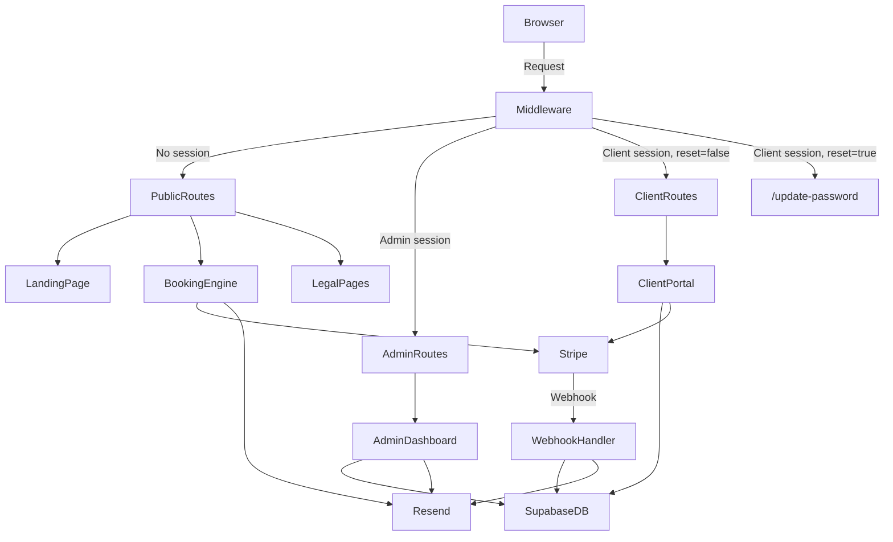
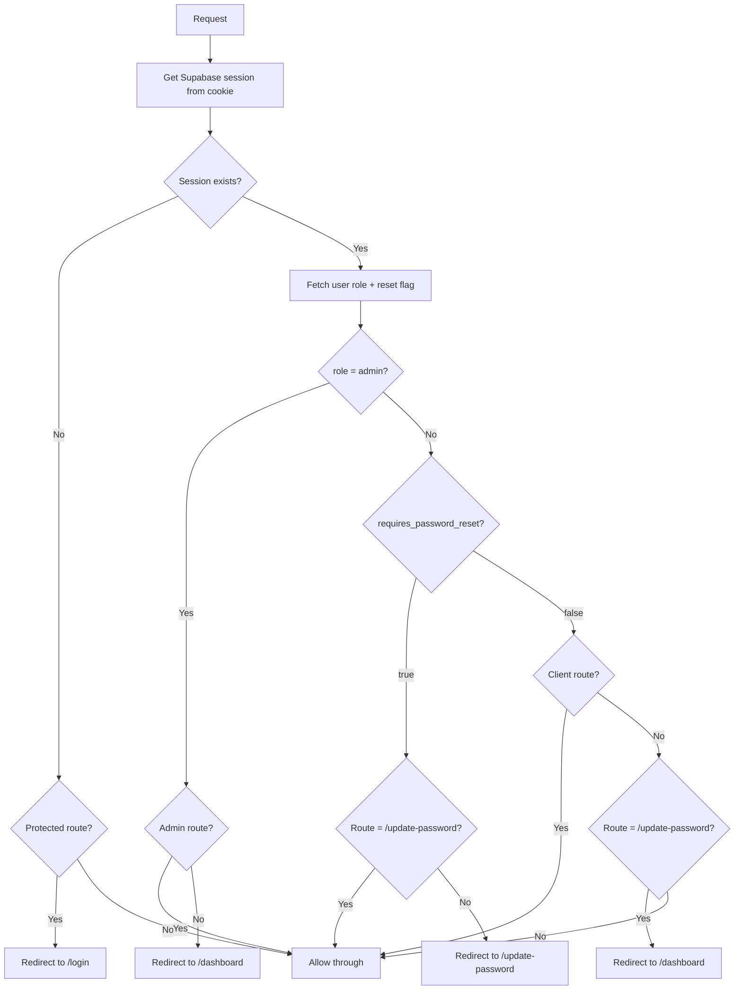
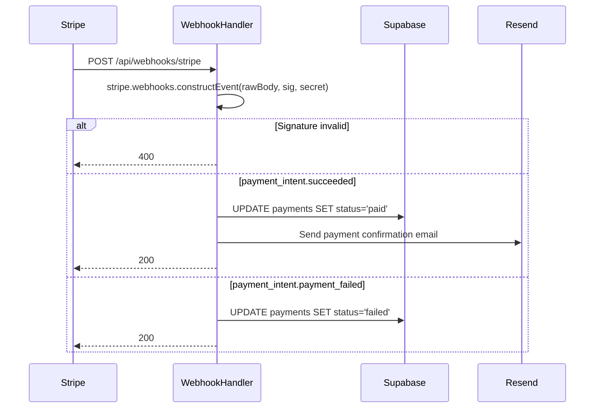
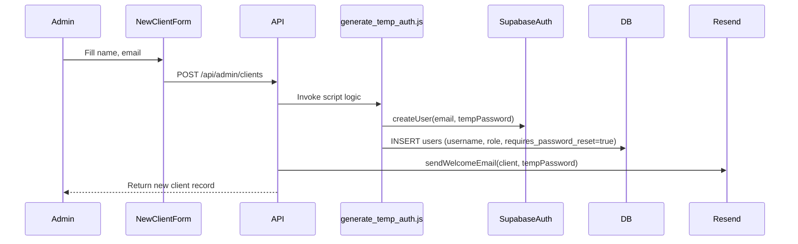
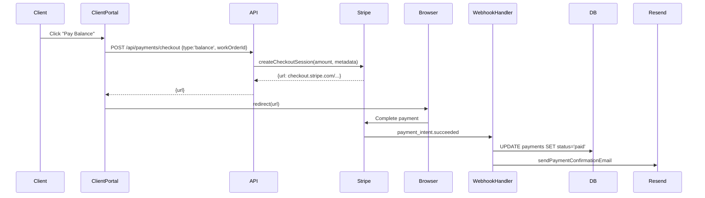

# Design Document: NIGMS App

## Overview

NIGMS App is a full-stack Next.js (App Router) application for Nailed It General Maintenance Services. It serves three distinct audiences through a single codebase:

1. **Public visitors** — landing page, project showcase, booking engine, newsletter signup, legal pages
2. **Clients** — authenticated portal for work orders, payments, and account management
3. **Admin (Charles)** — protected dashboard for client, work order, and payment management

The architecture uses Next.js route groups to separate concerns, Supabase for auth/database/RLS, Stripe for payments, and Resend for transactional email. Sessions are stored in secure HTTP-only cookies managed by Supabase's SSR auth helpers. Middleware enforces routing rules — including the forced password reset flow — at the edge before any page renders.

---

## Architecture

### High-Level Request Flow



### Route Group Structure

```
app/
├── (public)/                   # No auth required
│   ├── page.tsx                # Landing page
│   ├── projects/page.tsx       # Project showcase
│   ├── book/page.tsx           # Booking engine
│   ├── newsletter/             # Newsletter signup (API route)
│   └── legal/
│       ├── arbitration/page.tsx
│       ├── terms/page.tsx
│       ├── privacy/page.tsx
│       └── data-use/page.tsx
├── (admin)/                    # Requires admin role
│   ├── layout.tsx              # Admin layout + auth guard
│   ├── dashboard/page.tsx
│   ├── clients/
│   │   ├── page.tsx            # Client list
│   │   └── [id]/page.tsx       # Client detail
│   ├── work-orders/
│   │   ├── page.tsx
│   │   └── [id]/page.tsx
│   └── payments/page.tsx
├── (client)/                   # Requires client role, reset=false
│   ├── layout.tsx              # Client layout + auth guard
│   ├── dashboard/page.tsx
│   ├── work-orders/
│   │   ├── page.tsx
│   │   └── new/page.tsx
│   └── payments/page.tsx
├── update-password/            # Restricted session only
│   └── page.tsx
├── login/page.tsx              # Public auth page
├── api/
│   ├── webhooks/stripe/route.ts
│   ├── booking/route.ts
│   ├── newsletter/route.ts
│   ├── promo/validate/route.ts
│   └── payments/checkout/route.ts
├── layout.tsx                  # Root layout (ThemeProvider)
└── page.tsx                    # Redirects to landing or dashboard
```

### Middleware Logic

`middleware.ts` runs on every request and enforces all routing rules server-side:



Key middleware rules:
- Admin routes (`/admin/*`) → 403 if role ≠ `admin`
- Restricted session (`requires_password_reset = true`) → all routes except `/update-password` redirect to `/update-password`
- Normal client session (`requires_password_reset = false`) → `/update-password` redirects to `/dashboard`
- Unauthenticated → protected routes redirect to `/login`

---

## Components and Interfaces

### Shared Components (`components/`)

| Component | Purpose |
|---|---|
| `Navbar` | Top navigation with dark/light toggle, auth state links |
| `Footer` | Site footer with legal page links |
| `ThemeToggle` | `next-themes` toggle button (sun/moon icon) |
| `WorkOrderCard` | Displays a single work order summary |
| `PaymentRow` | Displays a single payment record in a table |
| `StatusBadge` | Color-coded badge for work order / payment status |
| `PromoCodeInput` | Controlled input with server-side validation trigger |
| `ConfirmDialog` | Reusable modal for destructive actions |
| `LoadingSpinner` | Consistent loading state indicator |
| `FormError` | Field-level and form-level error display |

### Page-Level Components

**Admin:**
- `ClientTable` — searchable, sortable client list
- `WorkOrderTable` — filterable by status and client
- `PaymentTable` — filterable by status and client
- `ManualPaymentForm` — admin form to record offline payments
- `StatusUpdateForm` — inline status change with email trigger
- `NewClientForm` — creates client, generates temp credentials

**Client:**
- `DashboardSummary` — project status, outstanding balance
- `WorkOrderList` — client's own work orders
- `NewWorkOrderForm` — create work order from portal
- `PayBalanceButton` — initiates Stripe checkout for balance

**Public:**
- `BookingForm` — multi-step booking with payment selection
- `ProjectGrid` — project showcase cards
- `NewsletterForm` — email capture with validation
- `PromoCodeField` — promo code entry within booking flow

### API Route Interfaces

```typescript
// POST /api/booking
interface BookingRequest {
  name: string;
  email: string;
  phone: string;
  serviceType: string;
  preferredDate: string;
  promoCode?: string;
  paymentOption: 'deposit' | 'full';
  quotedAmount: number;
}

// POST /api/promo/validate
interface PromoValidateRequest { code: string; }
interface PromoValidateResponse { valid: boolean; waivesDeposit: boolean; }

// POST /api/payments/checkout
interface CheckoutRequest {
  workOrderId: string;
  type: 'deposit' | 'full' | 'balance';
  amount: number;
}

// POST /api/webhooks/stripe  (raw body, Stripe-Signature header)
// Returns 200 on success, 400 on signature failure
```

---

## Data Models

### Supabase Schema

```sql
-- Users table (extends Supabase auth.users)
CREATE TABLE public.users (
  id            UUID PRIMARY KEY REFERENCES auth.users(id) ON DELETE CASCADE,
  username      TEXT UNIQUE NOT NULL,          -- permanent, immutable
  role          TEXT NOT NULL DEFAULT 'client' CHECK (role IN ('admin', 'client')),
  is_active     BOOLEAN NOT NULL DEFAULT true,
  requires_password_reset BOOLEAN NOT NULL DEFAULT true,
  created_at    TIMESTAMPTZ NOT NULL DEFAULT now()
);

-- Work orders
CREATE TABLE public.work_orders (
  id            UUID PRIMARY KEY DEFAULT gen_random_uuid(),
  client_id     UUID NOT NULL REFERENCES public.users(id),
  title         TEXT NOT NULL,
  description   TEXT,
  status        TEXT NOT NULL DEFAULT 'pending'
                  CHECK (status IN ('pending','in_progress','completed','cancelled')),
  quoted_amount NUMERIC(10,2),
  created_at    TIMESTAMPTZ NOT NULL DEFAULT now(),
  updated_at    TIMESTAMPTZ NOT NULL DEFAULT now()
);

-- Payments
CREATE TABLE public.payments (
  id              UUID PRIMARY KEY DEFAULT gen_random_uuid(),
  work_order_id   UUID NOT NULL REFERENCES public.work_orders(id),
  client_id       UUID NOT NULL REFERENCES public.users(id),
  amount          NUMERIC(10,2) NOT NULL,
  method          TEXT NOT NULL CHECK (method IN ('stripe','manual')),
  status          TEXT NOT NULL DEFAULT 'pending'
                    CHECK (status IN ('pending','paid','failed')),
  stripe_payment_intent_id TEXT,
  created_at      TIMESTAMPTZ NOT NULL DEFAULT now()
);

-- Newsletter subscribers
CREATE TABLE public.newsletter_subscribers (
  id         UUID PRIMARY KEY DEFAULT gen_random_uuid(),
  email      TEXT UNIQUE NOT NULL,
  created_at TIMESTAMPTZ NOT NULL DEFAULT now()
);
```

### RLS Policies

```sql
-- ============================================================
-- users table
-- ============================================================
ALTER TABLE public.users ENABLE ROW LEVEL SECURITY;

-- Admin: full access
CREATE POLICY "admin_all_users" ON public.users
  FOR ALL USING (
    EXISTS (SELECT 1 FROM public.users u WHERE u.id = auth.uid() AND u.role = 'admin')
  );

-- Client: read own record only (blocked entirely during restricted session)
CREATE POLICY "client_read_own_user" ON public.users
  FOR SELECT USING (
    id = auth.uid()
    AND EXISTS (
      SELECT 1 FROM public.users u
      WHERE u.id = auth.uid()
        AND u.requires_password_reset = false
    )
  );

-- ============================================================
-- work_orders table
-- ============================================================
ALTER TABLE public.work_orders ENABLE ROW LEVEL SECURITY;

CREATE POLICY "admin_all_work_orders" ON public.work_orders
  FOR ALL USING (
    EXISTS (SELECT 1 FROM public.users u WHERE u.id = auth.uid() AND u.role = 'admin')
  );

-- Client: own records, only when NOT in restricted session
CREATE POLICY "client_own_work_orders" ON public.work_orders
  FOR ALL USING (
    client_id = auth.uid()
    AND EXISTS (
      SELECT 1 FROM public.users u
      WHERE u.id = auth.uid()
        AND u.requires_password_reset = false
    )
  );

-- ============================================================
-- payments table
-- ============================================================
ALTER TABLE public.payments ENABLE ROW LEVEL SECURITY;

CREATE POLICY "admin_all_payments" ON public.payments
  FOR ALL USING (
    EXISTS (SELECT 1 FROM public.users u WHERE u.id = auth.uid() AND u.role = 'admin')
  );

-- Client: own records, only when NOT in restricted session
CREATE POLICY "client_own_payments" ON public.payments
  FOR ALL USING (
    client_id = auth.uid()
    AND EXISTS (
      SELECT 1 FROM public.users u
      WHERE u.id = auth.uid()
        AND u.requires_password_reset = false
    )
  );

-- ============================================================
-- newsletter_subscribers table
-- ============================================================
ALTER TABLE public.newsletter_subscribers ENABLE ROW LEVEL SECURITY;

-- Public insert (via service role in API route)
-- Admin read
CREATE POLICY "admin_read_newsletter" ON public.newsletter_subscribers
  FOR SELECT USING (
    EXISTS (SELECT 1 FROM public.users u WHERE u.id = auth.uid() AND u.role = 'admin')
  );
```

### TypeScript Types

```typescript
// lib/types.ts

export type UserRole = 'admin' | 'client';
export type WorkOrderStatus = 'pending' | 'in_progress' | 'completed' | 'cancelled';
export type PaymentStatus = 'pending' | 'paid' | 'failed';
export type PaymentMethod = 'stripe' | 'manual';

export interface UserProfile {
  id: string;
  username: string;
  role: UserRole;
  is_active: boolean;
  requires_password_reset: boolean;
  created_at: string;
}

export interface WorkOrder {
  id: string;
  client_id: string;
  title: string;
  description: string | null;
  status: WorkOrderStatus;
  quoted_amount: number | null;
  created_at: string;
  updated_at: string;
}

export interface Payment {
  id: string;
  work_order_id: string;
  client_id: string;
  amount: number;
  method: PaymentMethod;
  status: PaymentStatus;
  stripe_payment_intent_id: string | null;
  created_at: string;
}
```

---

## lib/ Modules

### `lib/supabase.ts`

Exports two Supabase clients:
- `createServerClient()` — uses `@supabase/ssr` with cookie store for Server Components and Route Handlers
- `createBrowserClient()` — for Client Components that need real-time or auth state

```typescript
// Server client (used in Server Components, middleware, Route Handlers)
import { createServerClient as _createServerClient } from '@supabase/ssr';
import { cookies } from 'next/headers';

export function createServerClient() {
  const cookieStore = cookies();
  return _createServerClient(
    process.env.NEXT_PUBLIC_SUPABASE_URL!,
    process.env.NEXT_PUBLIC_SUPABASE_ANON_KEY!,
    { cookies: { get: (n) => cookieStore.get(n)?.value } }
  );
}
```

### `lib/stripe.ts`

```typescript
import Stripe from 'stripe';
export const stripe = new Stripe(process.env.STRIPE_SECRET_KEY!, {
  apiVersion: '2024-06-20',
});
```

### `lib/resend.ts`

```typescript
import { Resend } from 'resend';
export const resend = new Resend(process.env.RESEND_API_KEY!);
```

### `scripts/generate_temp_auth.js`

Node.js script (not bundled into the app) that:
1. Generates a random 8-character alphanumeric username prefix
2. Generates a random 12-character password
3. Calls the Supabase Admin API to create the auth user
4. Inserts a row into `public.users` with `requires_password_reset = true`
5. Prints credentials to stdout for Charles to relay to the client

---

## Stripe Integration

### Checkout Session Creation

Two checkout session types are created server-side in `/api/payments/checkout`:

```
deposit  → line_item amount = Math.round(quotedAmount * 0.15 * 100) cents
full     → line_item amount = Math.round(quotedAmount * 100) cents
balance  → line_item amount = outstanding balance in cents
```

Each session includes `metadata.workOrderId` and `metadata.clientId` so the webhook can correlate the payment.

### Promo Code Validation

`/api/promo/validate` is a server-only Route Handler. The valid codes and their effects are stored in an environment variable or server-side constant — never exposed to the client bundle. `NAILEDIT` returns `{ valid: true, waivesDeposit: true }`.

### Webhook Handler (`/api/webhooks/stripe/route.ts`)



The route handler must use `export const config = { api: { bodyParser: false } }` equivalent — in App Router, read the raw body via `req.text()` before passing to `stripe.webhooks.constructEvent`.

---

## Email Automation (Resend)

All email sending is encapsulated in `lib/email.ts` with typed functions:

| Function | Trigger | Recipient |
|---|---|---|
| `sendWelcomeEmail(client, tempPassword)` | New client created | Client |
| `sendPasswordResetEmail(client, tempPassword)` | Admin resets password | Client |
| `sendWorkOrderStatusEmail(client, workOrder)` | Admin updates status | Client |
| `sendPaymentConfirmationEmail(client, payment)` | Stripe success or manual payment | Client |
| `sendNewsletterConfirmationEmail(email)` | Newsletter signup | Subscriber |
| `sendBookingConfirmationEmail(email, booking)` | Booking payment complete | Visitor |

All functions catch Resend API errors, log them with context, and return without throwing — so email failures never block the primary operation.

---

## Admin Dashboard Design

### Client Management Flow



### Work Order Status Update

When admin changes status → server action updates `work_orders.status` and calls `sendWorkOrderStatusEmail`. The status update and email send are independent — a Resend failure logs but does not roll back the DB write.

---

## Client Portal Design

### Balance Payment Flow



---

## Dark/Light Mode

`next-themes` wraps the root layout. The `ThemeToggle` component uses `useTheme()` (client component). Tailwind's `darkMode: 'class'` strategy is used — `next-themes` adds/removes the `dark` class on `<html>`. The user's preference is persisted in `localStorage` by `next-themes` automatically.

```tsx
// app/layout.tsx
import { ThemeProvider } from 'next-themes';
export default function RootLayout({ children }) {
  return (
    <html lang="en" suppressHydrationWarning>
      <body>
        <ThemeProvider attribute="class" defaultTheme="system" enableSystem>
          {children}
        </ThemeProvider>
      </body>
    </html>
  );
}
```

---

## Error Handling

| Scenario | Handling |
|---|---|
| Supabase auth error on login | Display generic "Invalid credentials" — no field hint |
| Supabase DB error in Server Component | Return error state, render error UI |
| Stripe checkout creation failure | Return 500, display user-facing error message |
| Stripe webhook signature failure | Return 400, log event, discard |
| Resend API error | Log error with context, continue primary operation |
| Invalid promo code | Return `{ valid: false }`, display error in UI |
| Duplicate newsletter email | Return informational message, no DB insert |
| Restricted session accessing protected route | Middleware redirect to `/update-password` |
| Client accessing admin route | Middleware returns 403 |
| Inactive client attempting login | Auth check returns generic error |

---

## Testing Strategy

### Unit Tests

Focus on pure functions and business logic:
- Deposit calculation: `calculateDeposit(amount)` → `amount * 0.15`
- Promo code validation logic
- Password validation (matching, non-empty)
- Email template rendering functions
- Work order status transition validation

### Property-Based Tests

See Correctness Properties section below. Use a property-based testing library (e.g., `fast-check` for TypeScript) with minimum 100 iterations per property.

### Integration Tests

- Stripe webhook handler with mock Stripe events (valid and invalid signatures)
- Supabase RLS policy verification with test users of each role
- Resend email dispatch (mocked Resend client)

### Smoke Tests

- Middleware routing rules (admin, client, restricted session, unauthenticated)
- Environment variable presence check on startup


---

## Correctness Properties

*A property is a characteristic or behavior that should hold true across all valid executions of a system — essentially, a formal statement about what the system should do. Properties serve as the bridge between human-readable specifications and machine-verifiable correctness guarantees.*

Property-based tests use `fast-check` (TypeScript) with a minimum of 100 iterations per property. Each test is tagged with `Feature: nigms-app, Property N: <text>`.

---

### Property 1: Project list renders all entries with required fields

*For any* list of project records, the rendered project list component should include each project's title, description, and status — and no project should be omitted from the output.

**Validates: Requirements 1.2, 1.3**

---

### Property 2: Theme preference round-trip

*For any* theme selection (dark or light), toggling to that theme and reloading the page should restore the same theme from the persisted preference.

**Validates: Requirements 1.5**

---

### Property 3: Newsletter deduplication

*For any* valid email address, submitting the newsletter form twice should result in exactly one record in `newsletter_subscribers` — the second submission should not create a duplicate.

**Validates: Requirements 2.3**

---

### Property 4: Newsletter email validation rejects non-emails

*For any* string that does not conform to a valid email format, the newsletter form should display a validation error and not insert a record into the database.

**Validates: Requirements 2.4**

---

### Property 5: Deposit calculation is always 15%

*For any* positive quoted service amount, the deposit amount calculated by the booking engine should equal exactly `Math.round(amount * 0.15 * 100) / 100` (i.e., 15% rounded to the nearest cent).

**Validates: Requirements 3.4**

---

### Property 6: Invalid promo codes are always rejected

*For any* string that is not a recognized promo code, the `/api/promo/validate` endpoint should return `{ valid: false }` and the deposit requirement should remain unchanged.

**Validates: Requirements 3.8**

---

### Property 7: Booking creates a pending work order

*For any* valid booking form submission (name, email, phone, service type, preferred date), the booking engine should create exactly one work order record in the database with `status = 'pending'`.

**Validates: Requirements 3.2**

---

### Property 8: Session cookie is always HttpOnly

*For any* successful login by any user (admin or client), the resulting session cookie should have the `HttpOnly` flag set to `true` and the `Secure` flag set to `true`.

**Validates: Requirements 5.2, 13.1**

---

### Property 9: Invalid credentials produce a generic error

*For any* combination of username and password that does not match a valid account, the authentication response should return a single generic error message that does not indicate which field (username or password) is incorrect.

**Validates: Requirements 5.3**

---

### Property 10: Client data isolation via RLS

*For any* two distinct client users A and B, querying `work_orders` or `payments` as client A should never return any record where `client_id = B.id`. The result set must contain only records belonging to client A.

**Validates: Requirements 5.6, 13.3**

---

### Property 11: Restricted session blocks all non-update-password routes

*For any* route path that is not `/update-password`, a request made with a session where `requires_password_reset = true` should be redirected to `/update-password` by the middleware — regardless of the route's normal access rules.

**Validates: Requirements 5.9, 14.7**

---

### Property 12: Client dashboard renders all work orders and payments

*For any* client with N work orders and M payments, the client dashboard should render exactly N work order entries and M payment entries — no records should be omitted.

**Validates: Requirements 6.1, 6.2, 6.3**

---

### Property 13: Pay Balance action appears for any positive outstanding balance

*For any* work order where the outstanding balance is greater than zero, the rendered `WorkOrderCard` component should include a visible "Pay Balance" action element.

**Validates: Requirements 6.4**

---

### Property 14: New work order is always created with pending status and correct client ID

*For any* valid work order form submission by an authenticated client, the created `work_orders` record should have `status = 'pending'` and `client_id` equal to the authenticated user's ID.

**Validates: Requirements 7.2**

---

### Property 15: Work order form validation rejects incomplete submissions

*For any* work order form submission where one or more required fields (title) are missing or empty, the form should display field-level validation errors and no database record should be created.

**Validates: Requirements 7.3**

---

### Property 16: Admin routes deny access to all non-admin users

*For any* route under the `(admin)` route group and *for any* request made by a non-admin user (unauthenticated or client role), the middleware should deny access — redirecting unauthenticated users to `/login` and returning 403 for authenticated clients.

**Validates: Requirements 8.1, 8.2, 8.3**

---

### Property 17: New client always has requires_password_reset = true

*For any* client account created through the admin dashboard, the resulting `users` record should have `requires_password_reset = true` immediately after creation.

**Validates: Requirements 9.3**

---

### Property 18: Welcome email is sent for every new client

*For any* new client account creation, the `sendWelcomeEmail` function should be called exactly once with the correct client data and temporary password.

**Validates: Requirements 9.5, 12.1**

---

### Property 19: Admin sees all records across all clients

*For any* set of records in `work_orders` or `payments` belonging to any combination of clients, the admin user's query should return all records — no record should be filtered out by RLS.

**Validates: Requirements 10.1, 10.2, 13.4**

---

### Property 20: Work order status update persists and triggers email

*For any* work order and *for any* valid target status value, updating the status via the admin dashboard should persist the new status to the database and invoke `sendWorkOrderStatusEmail` with the updated work order.

**Validates: Requirements 10.3, 12.2**

---

### Property 21: Manual payment creates a record and triggers email

*For any* manual payment submission (amount, work order ID), the system should create a `payments` record with `method = 'manual'` linked to the correct work order, and invoke `sendPaymentConfirmationEmail` for the associated client.

**Validates: Requirements 10.4, 10.5, 12.4**

---

### Property 22: Webhook signature verification gates all processing

*For any* webhook request with an invalid or missing `Stripe-Signature` header, the handler should return HTTP 400 and perform no database writes or email sends.

**Validates: Requirements 11.2, 11.3**

---

### Property 23: Webhook updates payment status correctly

*For any* valid `payment_intent.succeeded` event, the `payments` record with the matching `stripe_payment_intent_id` should have its status updated to `'paid'`. *For any* valid `payment_intent.payment_failed` event, the status should be updated to `'failed'`.

**Validates: Requirements 11.4, 11.5, 6.6, 12.3**

---

### Property 24: Email errors never block primary operations

*For any* Resend API error (network failure, rate limit, invalid address), the calling function should catch the error, log it with context, and return successfully — the primary database operation should not be rolled back or blocked.

**Validates: Requirements 12.6**

---

### Property 25: Restricted session blocks work_orders and payments at DB level

*For any* user with `requires_password_reset = true`, a direct Supabase query against `work_orders` or `payments` should return zero rows — the RLS policy should deny access at the database level regardless of the application layer.

**Validates: Requirements 13.6**

---

### Property 26: Password mismatch always produces a validation error

*For any* two strings where `password !== confirmPassword`, submitting the password reset form should display a validation error and not call the password update API.

**Validates: Requirements 14.5**

---

### Property 27: Successful password reset clears the reset flag

*For any* client with `requires_password_reset = true`, successfully submitting a valid new password should result in `requires_password_reset = false` in the database and redirect the client to `/dashboard`.

**Validates: Requirements 14.4**

---

### Property 28: Username is read-only on the password reset screen

*For any* client's password reset page render, the username should be displayed in a read-only element — there should be no `<input>` or editable control that allows the username value to be changed.

**Validates: Requirements 14.2**

---

### Property 29: Normal session cannot access /update-password

*For any* client with `requires_password_reset = false`, navigating to `/update-password` should redirect to `/dashboard` — the password reset screen should not be accessible to clients who have already set their permanent password.

**Validates: Requirements 14.8**
